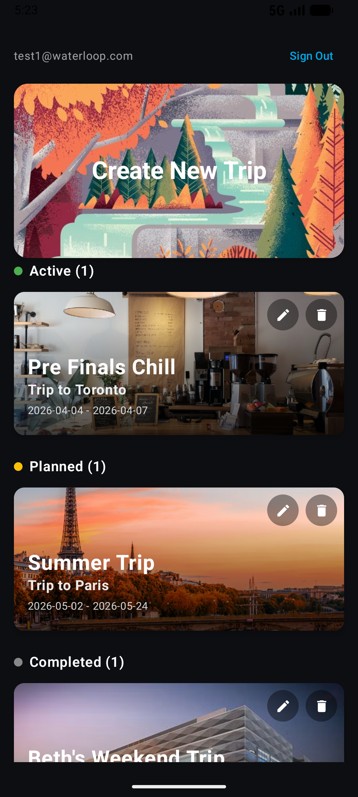
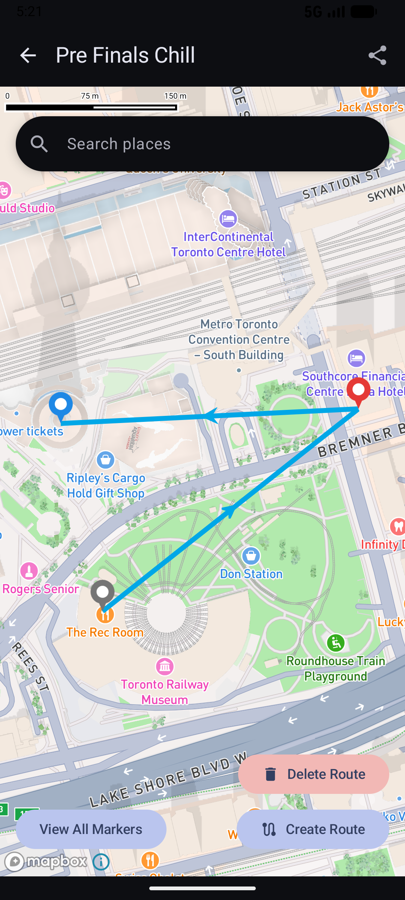
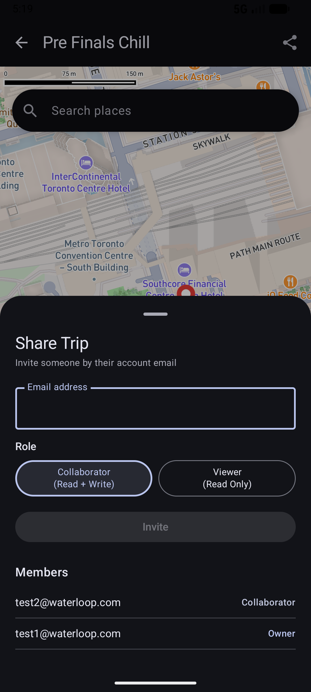
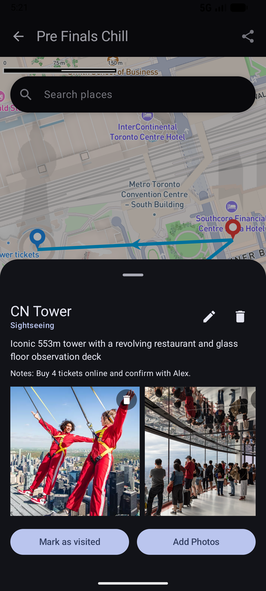
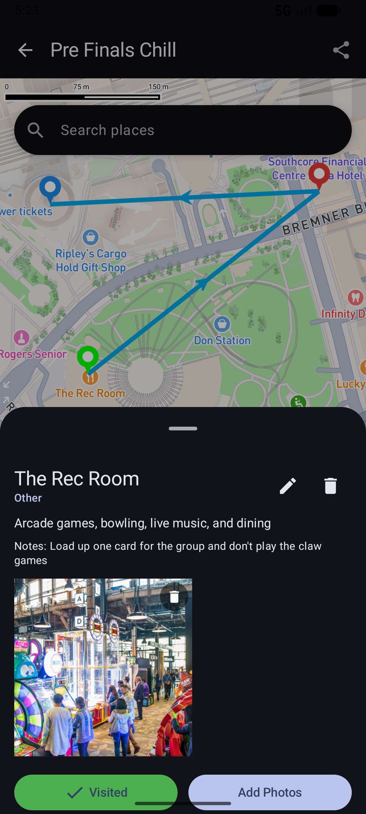
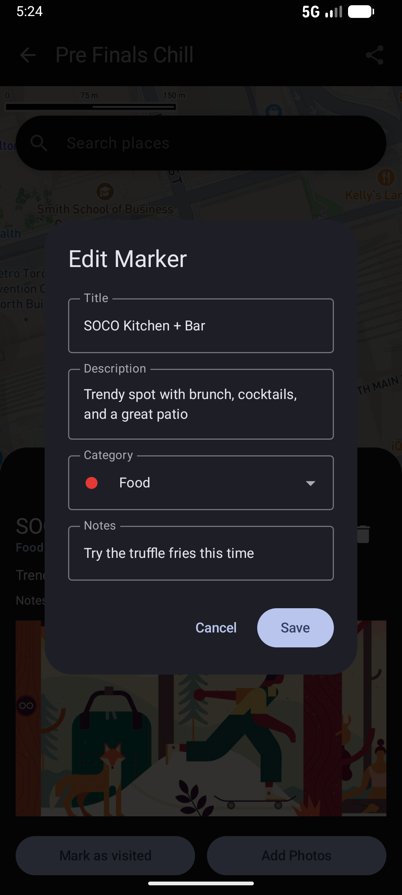

# RoutePal

**Collaborative trip planning, built for the road.**

RoutePal is an Android app that helps you plan, experience, and remember trips through an interactive map-based interface. Instead of organizing travel plans as lists or timelines, it centers the planning experience around a map — letting you visually place markers at locations you want to visit, attach photos and notes, build routes, and share everything with travel companions in real time. After a trip is completed, the app transforms into an interactive recap where you can revisit your journey by exploring the final route and viewing the photos and notes attached to each location.

---

## Screenshots

<p align="center">
  
  
  
  
  
  
</p>

---

## Features

### Trip management
Create and manage multiple trips, each with its own map. Trips are automatically organized by status — **Active**, **Planned**, or **Completed** — so it's easy to see what's coming up and what you've already done. When a trip is finished, the route and visited markers are preserved as a travel memory recap.

### Interactive map & markers
Tap anywhere on the map to drop a marker, or search for a place by name using the search bar. Each marker has a title, description, category (food, sightseeing, accommodation, and more), and a notes field. Markers are colour-coded by category, and visited locations display in green so you can always see what remains on your itinerary.

### Photo attachments
Attach photos directly to any marker from your camera roll. Photos are stored per-marker and displayed in a gallery, letting you document exactly what a place looked like when you visited.

### Route planning
Connect markers into a custom route to visualize your itinerary. RoutePal draws directional arrows between stops so you can see the order and flow of your trip on the map. Unlike GPS apps, the route is fully manual — you decide the order based on your own priorities, not an algorithm.

### Real-time collaboration
Share any trip by email. Collaborators get **read + write** access and can add or edit markers live — changes appear on everyone's map instantly. Invite **Viewers** who can follow along without making edits. Role-based access (Owner, Collaborator, Viewer) is enforced throughout the app.

### Offline-first sync
RoutePal works without an internet connection. Every edit is saved locally first, then automatically pushed to the cloud when connectivity is restored. If two people edit the same data while offline, the app resolves conflicts using a last-write-wins strategy based on timestamps.

---

## Architecture

RoutePal is built on two complementary architectural patterns.

**MVVM (Model-View-ViewModel)** separates the app into three layers: the View layer (Compose screens) renders the UI and observes state; the ViewModel layer processes user input and manages UI state via `StateFlow`; and the Repository/Model layer handles all data access and business logic. Views never touch the database or backend directly — they only talk to ViewModels, which talk to repositories. This keeps each layer focused and makes the app straightforward to modify and test.

**Repository pattern** centralizes all data access behind `TripRepository`, `MarkerRepository`, `MarkerPhotoRepository`, and `AuthRepository`. These act as the single source of truth, coordinating between the local Room database and the Supabase backend. `SyncManager` and `RealtimeManager` interact with the data layer to push unsynced changes and propagate live updates from collaborators, without ViewModels or UI components ever needing to know the details.

---

## Installation

> Requires Android Studio Hedgehog (2023.1.1) or later, and Android SDK 26+.

```bash
# 1. Clone the repo
git clone https://github.com/Surya123234/team-waterl-OOP.git
cd team-waterl-OOP

# 2. Open in Android Studio
#    File → Open → select the cloned folder

# 3. Add your config — create local.properties in the project root:
SUPABASE_URL=your_supabase_url
SUPABASE_ANON_KEY=your_supabase_anon_key
MAPBOX_ACCESS_TOKEN=your_mapbox_token

# 4. Build & run
#    Select a device / emulator and hit Run (Shift+F10)
```

---

## Team

| Name | ID |
|---|---|
| Surya Sendhilraj | 20949349 |
| Niharika Srivatsa | 20935935 |
| Vedanshee Patel | 20948981 |
| Sharang Goel | 21035076 |
| Advait Sangle | 20994869 |
| Hetarth Mahida | 21022244 |

[Team contract](https://docs.google.com/document/d/1fmmSnTnN5tbHDvTeoqfRX5i9_I4y48rrhrLXV7Q2cq0/edit?usp=sharing)
